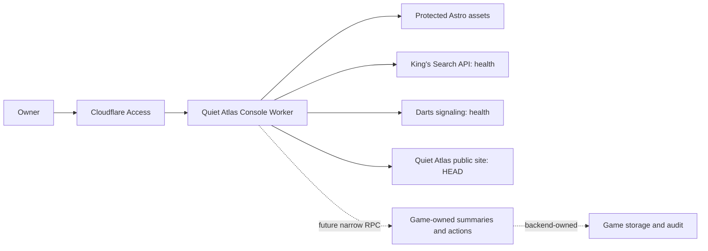

# Unified Quiet Atlas console foundation

## Decision and scope

Use a single owner-facing console in this existing Astro repository. Deploy it
as its own Worker on `admin.quietatlas.io`, separately from the public site's
Cloudflare Pages project. A shared shell, resource registry, authentication,
monitoring conventions and eventual audit timeline provide cohesion while each
game retains its storage, Durable Objects and domain rules.

This increment provides working owner protection, navigation, game/site modules,
bounded service reachability, request logging, future contracts and migration
documentation. It does not replace the existing game administration surfaces.
Links remain visible while capabilities move into the console. The existing
dashboards retain their separate Access audiences and current behavior.

## Authentication boundary

Access protects the entire hostname without a path exception. The Worker also
verifies signature (RS256/JWKS), exact team issuer, app-specific audience, expiry,
issued-at claim, subject and exact owner email. A legacy app JWT cannot unlock
the console. Authorization failure protects HTML, JS, CSS, images, unknown
routes and APIs alike. No caller-controlled header can enable local access.

Read the actual Access team hostname from the account; do not infer its spelling
from the brand name. Private deployment settings store the owner email, team and
audience outside Git and install them as private Worker bindings. The owner's
existing exact-email policy is reused without
adding identities or service credentials. Cookies are HTTP-only.

Wrangler runs the Worker before **all** static assets. Responses are private,
no-store, same-origin, non-embeddable, no-referrer and have an external-asset-only
CSP. API errors are JSON; unknown API routes never fall back to console HTML.
Only GET APIs and GET/HEAD assets exist. Existing action endpoints are not proxied.

## Registry, data and modules

`apps/console/shared/registry.ts` owns the allowlisted resource IDs, routes,
descriptions, existing destinations and truthful capabilities. No URL, binding,
actor or game identity supplied by a browser selects an upstream service.

`shared/contracts.ts` defines schema v1 for the registry, availability snapshot,
verified owner actor, future `ConsoleService.getSummary()` and admin audit event.
The RPC interface is an integration contract, not an already-deployed entrypoint.
Do not configure a service with an entrypoint until its backend actually exports
and tests it. This foundation binds the real default Workers for `/health` only.

Every richer metric must retain collection time, source, unit and window; null
means unavailable. Queue depth, active rooms, DAU and spend must not be inferred
from HTTP reachability. Event metrics and state/lease snapshots have different
semantics; preserve the distinction. Future summary RPC responses need allowlist
validation and bounds before rendering.

Static pages use the approved logo and Quiet Atlas palette. Interactive modules
can later use Astro React islands to reuse appropriate King's Search components;
route all requests through same-origin console APIs. Do not move server secrets
or old shared admin keys into browser code.

## Logs and audit

Each Worker request emits `console_request` JSON with schemaVersion, generated
requestId, fixed route classification, HTTP status and elapsed time. It never
records URLs/query strings, JWTs, cookies, email, IP, request bodies or upstream
response bodies. Cloudflare Workers Logs are enabled; automatic invocation logs
and traces are disabled to avoid implicitly recording request details. Correlate
an owner-reported `X-Request-ID` with the structured event in Cloudflare.

This is operational logging, not a persisted admin audit or long-term analytics
store. Before mutation migration, persist game-owned audit events with the
verified actor subject, resource/action/target, outcome, timestamp and requestId.
Use transactionally consistent records for database changes, and explicit
accepted/completed/failed events for asynchronous Durable Object actions.
Choose retention and archival needs during that implementation; do not promise
retention beyond the account's current Workers Logs plan.

## Failure, cost and rollback

Sources run in parallel with a three-second per-source deadline and bounded
response body. A source failure yields an isolated unavailable card, without raw
error details. Local preview never contacts production. Browser refresh is
manual and clears stale success states when a new check fails. There is no cron,
analytics token, new database or continuous polling in this increment.

Deploying the console does not alter game APIs, data, limits or the public site.
For rollback, use `wrangler rollback <previous-version-id>` in apps/console
after identifying the previously validated version. For the initial deployment,
leave Access protection active and disable/remove only the console custom-domain
route if needed. Keep old dashboards available until equivalent new controls
have passed authenticated acceptance checks. Never remove Access first.

## Primary references

- [Worker-first asset routing](https://developers.cloudflare.com/workers/static-assets/routing/worker-script/)
- [Access JWT validation](https://developers.cloudflare.com/cloudflare-one/access-controls/applications/http-apps/authorization-cookie/validating-json/)
- [Private service bindings](https://developers.cloudflare.com/workers/runtime-apis/bindings/service-bindings/)
- [Service binding RPC](https://developers.cloudflare.com/workers/runtime-apis/bindings/service-bindings/rpc/)
- [Astro on Cloudflare](https://developers.cloudflare.com/workers/framework-guides/web-apps/astro/)
