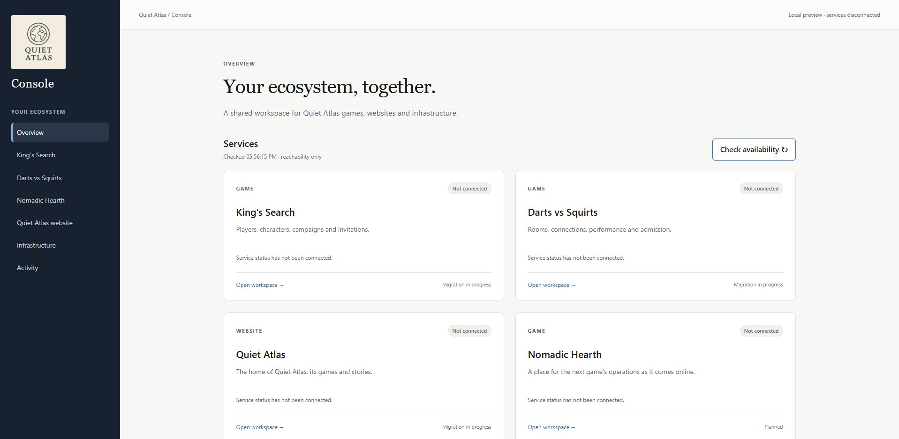
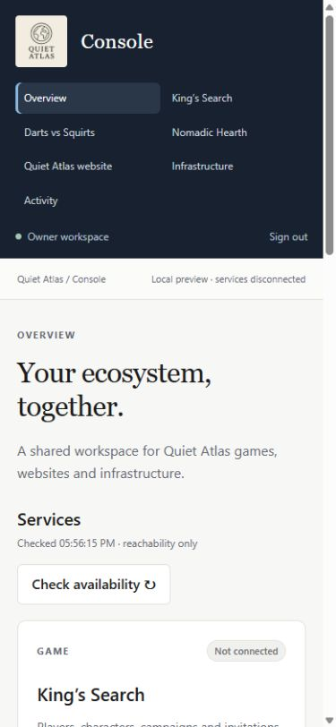

# Console foundation validation — 2026-10-08

Local environment: Windows, Node v24.11.1. Root public Astro dependencies were
installed from the existing lockfile; console dependencies were installed from
their own lockfile. Console pins Astro 7.3.8, jose 6.2.12, Wrangler 4.149.0 and
Miniflare 5.20261006.1-alpha. Root public Astro remains unchanged.

## Completed local checks

- `npm run validate` in `apps/console`: generated actual binding/runtime types,
  Worker/client TypeScript, eight static routes, nine tests and Wrangler dry run
  all passed. Worker bundle: 43.94 KiB / 12.28 KiB gzip; 20 static files.
- Signed owner JWT accepted. Wrong owner, tampered signature, old audience,
  wrong issuer, expired/not-yet-valid token and invalid subject rejected.
- Actual workerd plus actual built assets: anonymous and forged requests denied
  on pages, image and APIs; signed owner can read the eight routes, image and
  session API. Unknown APIs return JSON 404; POST returns 405. Blank production
  auth configuration returns 503, including for static assets.
- Private health binding tests: source failure is isolated; malformed/oversized
  responses and a never-completing source are bounded. Arbitrary personal data,
  upstream secrets and raw error bodies do not enter the snapshot.
- Local exemption only works for explicitly configured loopback URLs; spoofed
  forwarded-host and a public hostname cannot enable it. Local probes never
  call production. Copied brand logo bytes match the approved public asset.
- Built JS/CSS are external, compatible with the strict CSP. Browser testing
  caught Astro's default small-script inlining; it was disabled and regression
  coverage added before final verification.
- `npm audit --audit-level=high` in `apps/console`: zero vulnerabilities.
- Root `npm run build`: passed. Existing root image/prerender warnings remain;
  no public-site source, dependency lockfile or deployment setting was changed.
- Production preflight with missing/incomplete private settings: rejected
  deployment as intended. Owner/account details remain outside the public source.

## Browser verification

Ran the actual local Worker with `wrangler dev --env local --port 8810`.
Owner session identifies **Local preview · services disconnected**. Overview
refresh completes, updates the checked time and reports disconnected sources
honestly. Game navigation and the King's existing admin destination were
verified. At a 390×844 browser viewport, the available content width and document
width both measured 375 pixels (no horizontal overflow). Viewport override was
reset after the check. Screenshots are local preview evidence, not live data.

## Deployment state and remaining checks

The console Worker/custom domain is **not deployed**. Cloudflare Access creation
for `admin.quietatlas.io` was prepared with the existing exact-owner policy,
24-hour session and HTTP-only cookies. Automatic approval review rejected the
Create action because a persistent Access change requires action-time user
confirmation. The user was asked to approve that exact configuration or leave
deployment for the next agent. No workaround was attempted; no Access app,
token, game permission, Worker route or custom domain was created.

After approval, create the prepared Access app, verify the saved hostname/policy,
read its distinct AUD and fill ignored `apps/console/deployment.local.json`
from `deployment.example.json`. Then regenerate
types, validate, deploy and verify live anonymous redirects and actual owner
HTML/API/health checks. Keep workers.dev and preview URLs disabled. Until those
checks pass, do not claim a live unified console or actual game readiness.

Hosted CI status must be checked on the foundation PR. Prior game Actions jobs
were blocked by the account's Actions budget; local validation is the available
evidence if that blocker persists. No billing or spending changes are made.

This public repository's hosted runner did start. Its first install exposed
missing optional native packages in the Windows-generated lockfile. The console
lock was regenerated in a clean folder using the runner's npm 11.19.0, then its
clean-install metadata was verified locally. Check the latest PR run for the
Linux validation result. Cloudflare's public-site branch preview also built
successfully; that preview is the existing site, not the private console.
